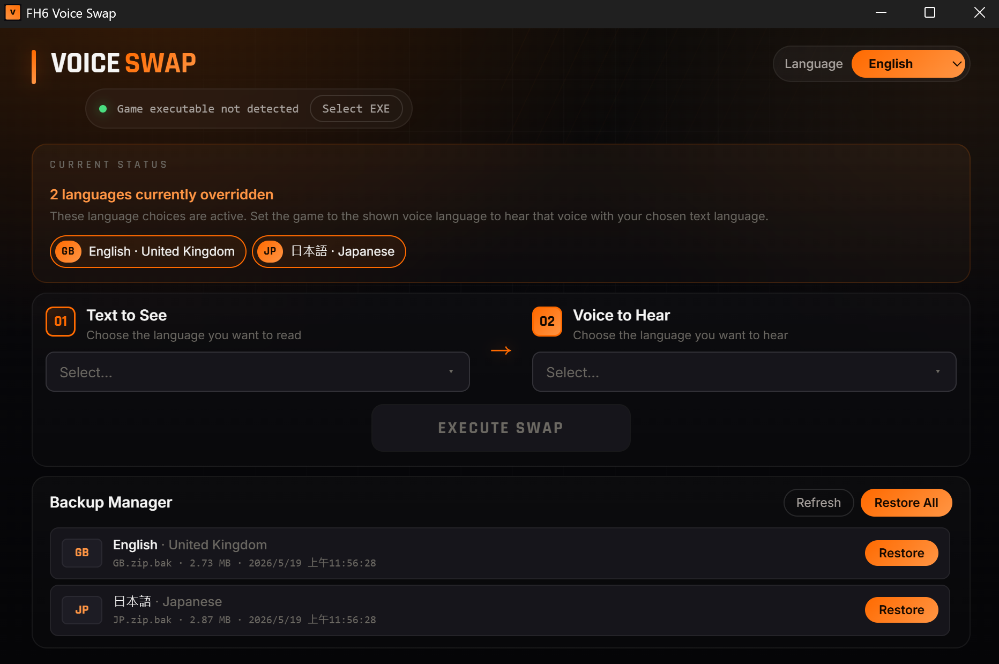

# Forza Horizon 6 Voice Swap

Annoyed that the game ties text and voice language together? This Windows tool lets you use a different voice language without changing the text language you normally play with.

The app locates the game's `StringTables` text files, copies your current text language `.zip`, and overwrites the target language `.zip`. After that, when you set the game to the target language, the game keeps using that target language's voice while reading the replaced text files. Before overwriting anything, the original target `.zip` is saved once as `.zip.bak` and kept until you restore it from the backup manager.

## Usage

1. Download and run `fh6-voice-swap-*-windows-x64.exe` from the release page.
2. If the game path is not detected, click `Select EXE` and choose `ForzaHorizon6.exe` from the game install folder.
3. Select the text language you want to see in the first dropdown.
4. Select the voice language you want to hear in the second dropdown.
5. Click `Execute Swap`.
6. Start the game and manually set the in-game language to the selected voice language.
7. Use the backup manager if you want to restore the original file later.

Important: the game must be set to the selected voice language after the swap. For example, if you want English text with Japanese voice, select `English` under `Text to See`, select `Japanese` under `Voice to Hear`, then set the in-game language to `Japanese`.



Each target language keeps one original `.zip.bak` backup. Existing backups are not overwritten by later swaps, and an already-swapped language cannot be used as the text source until it is restored.

## Build

```bash
npm ci
npx tauri build --no-bundle
```

The executable is created at:

```text
src-tauri/target/release/fh6-voice-swap.exe
```

## License

This project is licensed under the MIT License. See [LICENSE](LICENSE) for details.
